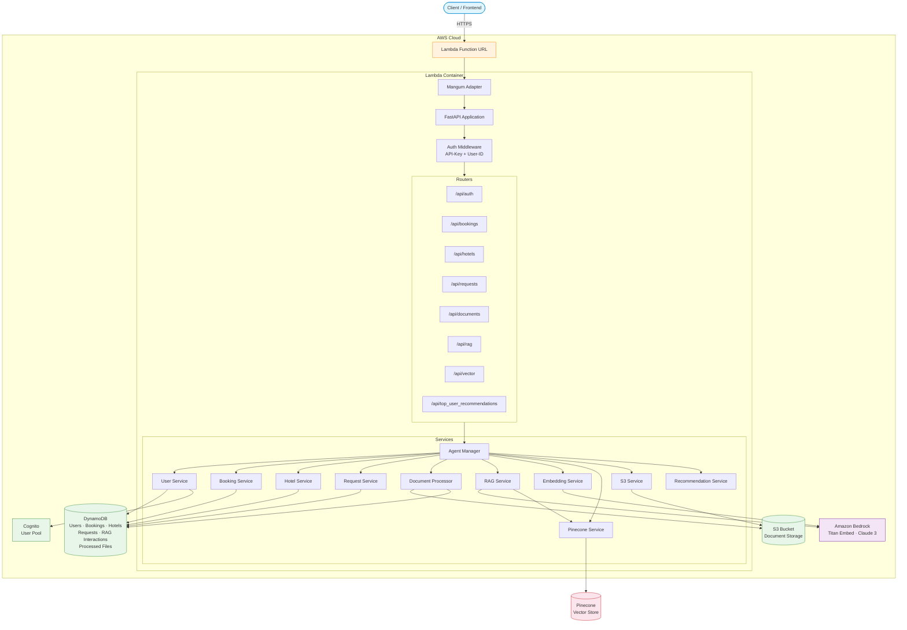

# Chariott API — Backend

A serverless backend for the Chariott hospitality and travel platform, built with FastAPI and deployed to AWS Lambda via Docker. The API powers hotel bookings, guest request management, document processing, and an AI-driven RAG (Retrieval-Augmented Generation) assistant backed by Amazon Bedrock and Pinecone.

## Architecture

| Layer | Technology |
|---|---|
| Runtime | Python 3.11 on AWS Lambda (Docker image) |
| Framework | FastAPI + Mangum |
| Infrastructure | AWS CDK (TypeScript) |
| Database | Amazon DynamoDB |
| Storage | Amazon S3 |
| Auth | Amazon Cognito + API-Key middleware |
| AI / Embeddings | Amazon Bedrock (Titan Embed, Claude 3) |
| Vector Store | Pinecone |



## API Endpoints

| Prefix | Tag | Description |
|---|---|---|
| `/api/auth` | auth | User authentication and profile management |
| `/api/bookings` | bookings | Hotel room booking operations |
| `/api/hotels` | hotels | Hotel and room information |
| `/api/requests` | requests | Guest service requests |
| `/api/documents` | documents | Document upload and processing |
| `/api/rag` | rag | RAG-powered conversational assistant |
| `/api/vector` | vectors | Vector embedding operations |
| `/api/top_user_recommendations` | top_user_recommendations | Personalised user recommendations |

Interactive Swagger docs are available at the root path (`/`).

## Project Structure

```
image/
├── Dockerfile
├── requirements.txt
└── src/
    ├── main.py                  # FastAPI app & Lambda handler
    ├── api/endpoints/           # Route handlers
    ├── core/config.py           # Pydantic settings
    ├── middleware/auth.py        # API-Key & user-ID middleware
    ├── schemas/                 # Pydantic request/response models
    ├── services/                # Business logic & AWS integrations
    └── utils/

codefest-backend-infra/         # AWS CDK stack (TypeScript)
└── lib/codefest-backend-infra-stack.ts
```

## Getting Started

### Prerequisites

- Python 3.11+
- Docker
- Node.js 18+ and npm (for CDK)
- AWS CLI configured with appropriate credentials

### Environment Variables

Create a `.env` file in the project root with the following:

```env
PRIVATE_AWS_ACCESS_KEY_ID=<your-aws-access-key>
PRIVATE_AWS_SECRET_ACCESS_KEY=<your-aws-secret-key>
PRIVATE_AWS_REGION=<aws-region>
S3_BUCKET_NAME=<s3-bucket-name>
COGNITO_USER_POOL_ID=<cognito-pool-id>
COGNITO_APP_CLIENT_ID=<cognito-client-id>
DYNAMODB_TABLE_NAME_USERS=<table-name>
DYNAMODB_TABLE_NAME_PROCESSED_FILES=<table-name>
DYNAMODB_TABLE_NAME_REQUESTS=<table-name>
DYNAMODB_TABLE_NAME_BOOKINGS=<table-name>
DYNAMODB_TABLE_NAME_HOTELS=<table-name>
DYNAMODB_TABLE_NAME_RAG_INTERACTIONS=<table-name>
API_KEY=<api-key>
PINECONE_API_KEY=<pinecone-api-key>
PINECONE_INDEX_NAME=<pinecone-index-name>
```

### Local Development

```bash
# Build the Docker image
docker build -t chariott-backend ./image

# Run locally
docker run --rm -p 8000:8000 \
  --entrypoint python \
  --env-file .env \
  chariott-backend main.py
```

The API will be available at `http://localhost:8000`. Navigate to `/docs` for the Swagger UI.

### Deploying to AWS

```bash
# Install CDK dependencies
cd codefest-backend-infra
npm install

# Synthesise the CloudFormation template
npx cdk synth

# Deploy
npx cdk deploy
```

CDK will build the Docker image, push it to ECR, and provision the Lambda function with a public function URL.

## Authentication

All requests (except `/docs` and `/openapi.json`) require an `API-Key` header matching the configured key. An optional `User-ID` header identifies the calling user for per-user operations.

## Diagrams

Database schemas and the RAG pipeline are documented as Mermaid diagrams in the repository root and `visualisation/` directory. Render them with:

```bash
npm install -g @mermaid-js/mermaid-cli
mmdc -i userDB.mmd -o diagram.svg
```

## License

This project is proprietary. All rights reserved.
